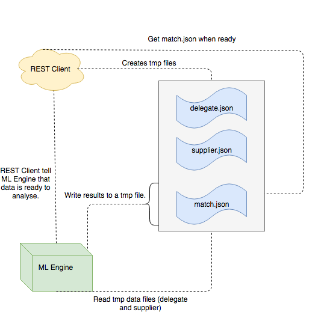

#Events Matching REST API Interface

## Introduction
A basic rest client built over Django to interact with [Event Matching ML Engine](https://acrotrend.visualstudio.com/_git/Events_ML_NLP_MatchingEngine). The current version of the api has one exposed   `POST /events-matching/` endpoint and the payload will consist of a json object which will include profile data of a delegate and a supplier.

## Basic Workflow


 - User executes the request.
 - `events_api_handler` recieves the request.
 - `events_api_handler` loads temporary directory `/tmp/events_ml_engine` using `Helper` class.
 - `events_api_handler` strigify the data and pass it to `Helper` class.
 - `Helper` class creates temporary json files as `delegate.json` and `supplier.json`.
 - `events_api_handler` calls [Events_ML_NLP_MatchingEngine](https://acrotrend.visualstudio.com/_git/Events_ML_NLP_MatchingEngine), which is identified using environment path `EVENT_RECOMMANDATION_PATH`. This means [Events_ML_NLP_MatchingEngine](https://acrotrend.visualstudio.com/_git/Events_ML_NLP_MatchingEngine) is not tied to any api exposed to public and its accessible by different clients.
 - [Events_ML_NLP_MatchingEngine](https://acrotrend.visualstudio.com/_git/Events_ML_NLP_MatchingEngine) run analyses on data stored in `delegate.json` and `supplier.json` and generate `match.json` in the tmp dir.
 - `events_api_handler` reads `match.json` and send it to the user in reponse.
 

## Prerequisites
- Python >= 2.7
- Django >= 1.11
- [Events_ML_NLP_MatchingEngine](https://acrotrend.visualstudio.com/_git/Events_ML_NLP_MatchingEngine) installed

## Basics
<pre>
> git clone ssh://acrotrend@acrotrend.visualstudio.com:22/
Events_ML_NLP_MatchingEngine/_git/
Events_ML_NLP_MatchingEngine_API
</pre>

<pre>
> cd Events_ML_NLP_MatchingEngine_API

> pip install -r requirements.txt

> python manage.py runserver
</pre>

## Sample
### Endpoint 
`POST /events-matching/`<br>

`Content-Type: application/json`<br>

`Data:`
 
```javascript
{
  "delegate": [...],
  "supplier": [...]
}
```

